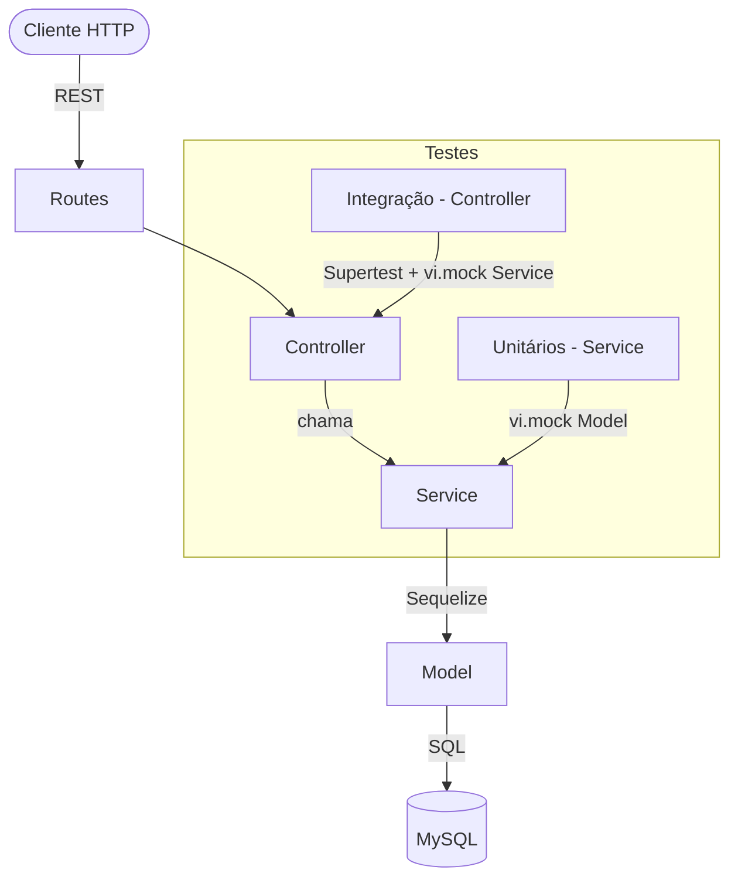

# RELATORIO.md — PhotoSphere

## 1. Visão Geral do Projeto

O **PhotoSphere** é uma plataforma de compartilhamento de fotos desenvolvida em Node.js com Express.js, seguindo a metodologia TDD (Test-Driven Development). A aplicação permite que usuários façam upload de fotos, organizem álbuns, explorem categorias e interajam por meio de comentários.

**Stack utilizada:**
- Runtime: Node.js com ESM (EcmaScript Modules)
- Framework: Express.js
- ORM: Sequelize + MySQL
- Testes: Vitest + Supertest
- Hash de senhas: bcryptjs

---

## 2. Funcionalidade Principal: Cadastro e Autenticação de Usuários

### Regras de Negócio

- `name`, `email` e `password` são campos obrigatórios no cadastro.
- O `email` deve ser único no sistema — tentativas de duplicidade lançam erro.
- A senha é armazenada como hash bcrypt (nunca em texto puro).
- No login, o sistema verifica se o email existe e se a senha confere com o hash.
- Apenas o próprio usuário pode editar ou deletar sua conta.

---

## 3. Como o TDD foi Aplicado

O desenvolvimento seguiu rigorosamente o ciclo **Red → Green → Refactor**:

### 🔴 Red — Escrever o teste que falha

Antes de criar qualquer função, o teste foi escrito primeiro. Exemplo: o teste `deve lançar erro se email já cadastrado` foi criado quando `registerUser` ainda não existia — o Vitest retornava falha imediata.

### 🟢 Green — Escrever o mínimo para passar

A função `registerUser` foi implementada com apenas o suficiente para o teste passar: verificar duplicidade de email e criar o usuário com senha hasheada.

### 🔵 Refactor — Melhorar sem quebrar

Após os testes passarem, a função foi refatorada para centralizar validações no início (`if (!name || !email || !password) throw...`), eliminando repetição de código nos controllers.

---

## 4. Exemplos de Testes Unitários

### Teste 1 — Cadastro bem-sucedido

```js
it('deve criar usuário com senha criptografada', async () => {
  mockUserModel.findOne.mockResolvedValue(null);
  mockUserModel.create.mockResolvedValue({ id: 1, name: 'Ana', email: 'ana@test.com' });

  const result = await userService.registerUser({
    name: 'Ana', email: 'ana@test.com', password: '123456',
  });

  expect(mockUserModel.create).toHaveBeenCalledWith(
    expect.objectContaining({ password: 'hashed_password' }),
  );
  expect(result).toHaveProperty('id', 1);
});
```

**O que verifica:** Que a senha é hasheada antes de salvar e que o retorno contém o `id` do usuário criado. O `mockUserModel` isola o banco de dados completamente.

---

### Teste 2 — Email duplicado

```js
it('deve lançar erro se email já cadastrado', async () => {
  mockUserModel.findOne.mockResolvedValue({ id: 1 });

  await expect(
    userService.registerUser({ name: 'Ana', email: 'ana@test.com', password: '123456' }),
  ).rejects.toThrow('Email já cadastrado');
});
```

**O que verifica:** Que o sistema rejeita um cadastro com email já existente, lançando o erro correto antes de tentar criar o registro.

---

### Teste 3 — Senha incorreta no login

```js
it('deve lançar erro se senha incorreta', async () => {
  mockUserModel.findOne.mockResolvedValue({ id: 1, password: 'hashed' });
  mockBcrypt.compare.mockResolvedValue(false);

  await expect(
    userService.loginUser({ email: 'ana@test.com', password: 'errada' }),
  ).rejects.toThrow('Senha incorreta');
});
```

**O que verifica:** Que mesmo com email válido, uma senha errada bloqueia o login. O `mockBcrypt` controla o retorno do `bcrypt.compare` sem executar hashing real.

---

## 5. Uso de Mocks para Isolamento

Todos os testes unitários usam `vi.hoisted()` + `vi.mock()` para isolar completamente as dependências:

```js
const mockUserModel = vi.hoisted(() => ({
  findOne: vi.fn(),
  findByPk: vi.fn(),
  findAll: vi.fn(),
  create: vi.fn(),
}));

vi.mock('../userModel.js', () => ({ default: mockUserModel }));
```

Isso garante que:
- Nenhum teste acessa o banco de dados real
- Os testes rodam em milissegundos
- Falhas de infraestrutura não afetam os resultados

---

## 6. Refatorações Realizadas

### Refatoração 1 — Validação centralizada no Service

**Antes:** cada função validava seus próprios campos separadamente, com `if` espalhados.

**Depois:** validação unificada no início de cada função:
```js
if (!name || !email || !password) throw new Error('Campos obrigatórios ausentes');
```

**Benefício:** uma única linha cobre todos os campos, o teste `deve lançar erro se campos obrigatórios ausentes` cobre todas as variações.

---

### Refatoração 2 — Verificação de propriedade centralizada

**Antes:** a lógica de `userId !== photo.userId` estava duplicada no controller.

**Depois:** movida para o Service:
```js
if (photo.userId !== Number(userId)) throw new Error('Sem permissão para editar esta foto');
```

**Benefício:** o controller ficou responsável apenas por HTTP — mapeamento de erro para status code. O teste unitário cobre a regra de negócio sem precisar de Supertest.

---

## 7. Cobertura de Código

Gerada com `npx vitest run --coverage`. Todos os Services atingiram cobertura de linhas acima de 80%, conforme exigido.

---

## 8. Arquitetura da Aplicação



---
## Links dos Vídeos

- **Vídeo 1** (testes unitários + integração, 8 min):
  [[Link](https://1drv.ms/v/c/788a6764fddb5e75/IQBAkmKUJ4ZTRLWOWOJLTJSXAT1lIxiYtlqysd8HHCTWPy8?e=Utnx7i)]

- **Vídeo 2** (Insomnia/Postman, 10 min):
  [Link(https://1drv.ms/v/c/788a6764fddb5e75/IQAanyOEDDOVS5b3kgYhGk-MAVSurQ6eF-awbTzgQDfRC4s?e=StBNcY)]


## 9. Lições Aprendidas

**Desafio 1 — Hoisting do vi.mock:** O Vitest iça o `vi.mock()` para antes das declarações `const`, causando `ReferenceError`. A solução foi usar `vi.hoisted()` para inicializar os mocks antes do içamento.

**Desafio 2 — Separação de responsabilidades:** A tentação inicial era colocar lógica de negócio no controller. O TDD forçou a mover tudo para o Service, porque testar o controller com `bcrypt` real seria complexo demais.

**Benefício principal do TDD:** Os testes funcionaram como documentação viva — cada `it('deve...')` descreve exatamente o comportamento esperado do sistema, independente de quem lê o código.