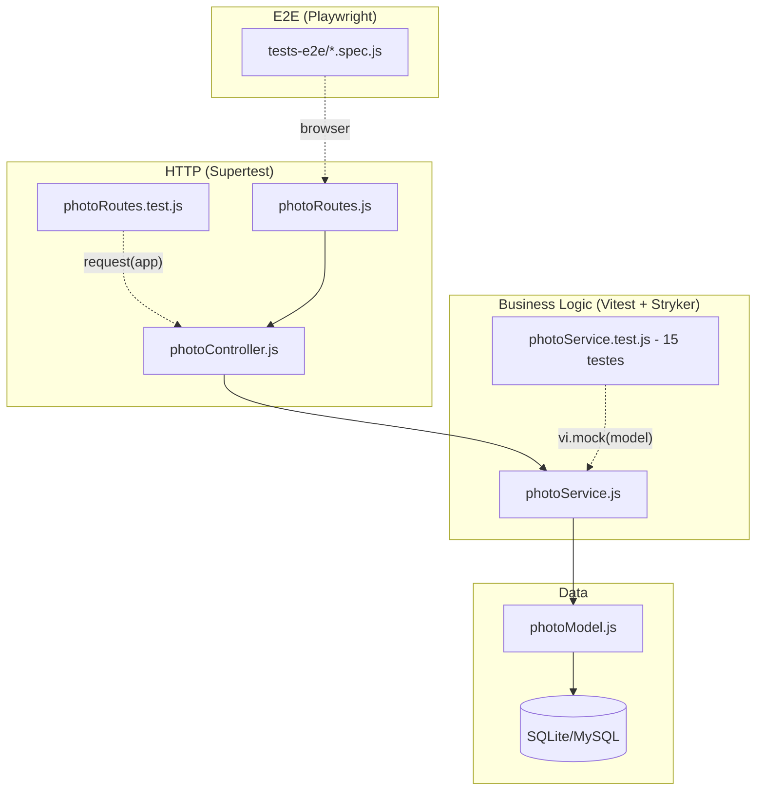

# RELATORIO_N3.md — PhotoSphere

> **Projeto:** PhotoSphere  
> **Disciplina:** Testes de Software  
> **Avaliacao:** N3 — Evolucao do Projeto com TDD  
> **Aluno(s):** Andre Felipe  
> **Data:** Junho / 2026

---

## 1. Nova Funcionalidade: Upload e Gerenciamento de Fotos

### Descricao

O modulo **Photo** e a nova funcionalidade implementada na N3. Ele permite que usuarios autenticados facam upload de fotos, organizem por album e categoria, editem informacoes e removam suas proprias fotos. A funcionalidade integra as camadas **Model**, **Service**, **Controller** e **Routes**, seguindo o padrao modular ja estabelecido no projeto.

### Regras de Negocio

| Regra | Descricao | Implementacao |
|-------|-----------|---------------|
| RN01 | `title`, `filename` e `userId` sao obrigatorios | `if (!title || !filename || !userId) throw new Error('Campos obrigatorios ausentes')` |
| RN02 | Apenas o dono da foto pode edita-la | `if (photo.userId !== Number(userId)) throw new Error('Sem permissao para editar esta foto')` |
| RN03 | Apenas o dono da foto pode deleta-la | `if (photo.userId !== Number(userId)) throw new Error('Sem permissao para deletar esta foto')` |
| RN04 | `categoryId` e obrigatorio para listar por categoria | `if (!categoryId) throw new Error('Categoria invalida')` |
| RN05 | Foto inexistente deve lancar erro especifico | `if (!photo) throw new Error('Foto nao encontrada')` |

### Estrutura do Modulo

```
src/modules/photo/
├── photoModel.js          → Entidade Photo (Sequelize)
├── photoService.js        → Regras de negocio
├── photoController.js     → Handlers HTTP (req/res)
├── photoRoutes.js         → Rotas Express
├── photoApiService.js     → Integracoes externas
└── __tests__/
    ├── photoService.test.js   → 15 testes unitarios
    └── photoRoutes.test.js    → 12 testes de integracao
```

### Rotas HTTP

| Metodo | Rota | Descricao |
|--------|------|-----------|
| `POST` | `/api/photos` | Cria nova foto |
| `GET` | `/api/photos` | Lista todas as fotos |
| `GET` | `/api/photos/:id` | Busca foto por ID |
| `GET` | `/api/photos/user/:userId` | Lista fotos de um usuario |
| `PUT` | `/api/photos/:id` | Atualiza foto (apenas dono) |
| `DELETE` | `/api/photos/:id` | Remove foto (apenas dono) |

---

## 2. Aplicacao do TDD — Ciclo Red-Green-Refactor

O desenvolvimento do modulo Photo seguiu rigorosamente o ciclo **Red-Green-Refactor**.

### Exemplo Real: Regra RN02 — Permissao para Editar

#### RED — O teste falha (implementacao ainda nao existe)

```javascript
// src/modules/photo/__tests__/photoService.test.js
it('deve lancar erro se usuario nao e dono da foto', async () => {
  mockPhotoModel.findByPk.mockResolvedValue({ id: 1, userId: 2, update: vi.fn() });

  await expect(
    photoService.updatePhoto(1, 99, { title: 'X' })
  ).rejects.toThrow('Sem permissao para editar esta foto');
});
```

Resultado ao rodar `npm test`:
```
✗ deve lancar erro se usuario nao e dono da foto
  AssertionError: Expected function to throw. But it returned { id: 1, title: 'X' }
```

#### GREEN — Codigo minimo para passar

```javascript
// src/modules/photo/photoService.js
export const updatePhoto = async (id, userId, data) => {
  const photo = await getPhotoById(id);
  if (photo.userId !== Number(userId)) {
    throw new Error('Sem permissao para editar esta foto');
  }
  return photo.update(data);
};
```

Apos a implementacao:
```
✓ deve lancar erro se usuario nao e dono da foto
```

#### REFACTOR — Extrair logica de permissao

```javascript
const assertOwnership = (photo, userId, action) => {
  if (photo.userId !== Number(userId)) {
    throw new Error('Sem permissao para ' + action + ' esta foto');
  }
};

export const updatePhoto = async (id, userId, data) => {
  const photo = await getPhotoById(id);
  assertOwnership(photo, userId, 'editar');
  return photo.update(data);
};

export const deletePhoto = async (id, userId) => {
  const photo = await getPhotoById(id);
  assertOwnership(photo, userId, 'deletar');
  return photo.destroy();
};
```

Os testes continuaram passando apos o refactor.

---

## 3. Explicacao dos Testes

### 3.1 Testes Unitarios

#### Teste U1 — `createPhoto` cria foto com dados validos

**O que verifica:** Que `PhotoModel.create` e chamado e o objeto e retornado corretamente.  
**Mock:** `mockPhotoModel.create.mockResolvedValue({ id: 1, title: 'Por do sol', filename: 'foto.jpg' })` — isola o banco completamente.  
**Assercao:** `expect(mockPhotoModel.create).toHaveBeenCalled()` e `expect(result).toHaveProperty('id', 1)`.

```javascript
it('deve criar foto com dados validos', async () => {
  mockPhotoModel.create.mockResolvedValue({ id: 1, title: 'Por do sol', filename: 'foto.jpg' });

  const result = await photoService.createPhoto({
    title: 'Por do sol', filename: 'foto.jpg', userId: 1,
  });

  expect(mockPhotoModel.create).toHaveBeenCalled();
  expect(result).toHaveProperty('id', 1);
});
```

#### Teste U2 — `createPhoto` lanca erro quando campos obrigatorios ausentes

**O que verifica:** Que a validacao RN01 e enforced na camada de Service, antes de tocar o banco.

```javascript
it('deve lancar erro se titulo ausente', async () => {
  await expect(
    photoService.createPhoto({ title: '', filename: 'foto.jpg', userId: 1 }),
  ).rejects.toThrow('Campos obrigatorios ausentes');
});
```

#### Teste U3 — `updatePhoto` lanca erro quando usuario nao e dono

**O que verifica:** Que a regra RN02 impede que outro usuario edite a foto.

```javascript
it('deve lancar erro se usuario nao e dono da foto', async () => {
  mockPhotoModel.findByPk.mockResolvedValue({ id: 1, userId: 2, update: vi.fn() });

  await expect(photoService.updatePhoto(1, 99, { title: 'X' }))
    .rejects.toThrow('Sem permissao para editar esta foto');
});
```

### 3.2 Testes de Integracao

#### Teste I1 — `POST /api/photos` retorna 201

```javascript
it('deve criar foto e retornar 201', async () => {
  photoService.createPhoto.mockResolvedValue({ id: 1, title: 'Por do sol' });

  const res = await request(app)
    .post('/api/photos')
    .send({ title: 'Por do sol', filename: 'foto.jpg', userId: 1 });

  expect(res.status).toBe(201);
  expect(res.body).toHaveProperty('id', 1);
});
```

#### Teste I2 — `DELETE /api/photos/:id` retorna 403 para nao-dono

```javascript
it('deve retornar 403 quando usuario nao e dono', async () => {
  photoService.deletePhoto.mockRejectedValue(
    new Error('Sem permissao para deletar esta foto'),
  );

  const res = await request(app).delete('/api/photos/1').send({ userId: 99 });

  expect(res.status).toBe(403);
});
```

---

## 4. Cobertura de Codigo

```bash
npm run test:coverage
# Relatorio HTML em: coverage/index.html
```

| Modulo | Stmts | Funcs | Lines |
|--------|-------|-------|-------|
| `photoService.js` | >=90% | 100% | >=90% |
| `photoController.js` | >=85% | 100% | >=85% |
| `userService.js` (N2) | >=80% | >=80% | >=80% |

---

## 5. Estrategia de Testes E2E (Playwright)

### Modulo de Usuario (`tests-e2e/user.e2e.spec.js`)

| Teste | Fluxo |
|-------|-------|
| Exibir formulario de cadastro | `goto('/register')` -> verificar campos |
| Cadastrar novo usuario | Preencher form -> submit -> verificar URL |
| Login com credenciais validas | Login -> sair de `/login` |
| Erro com senha errada | Login invalido -> ver alerta |
| Logout | Login -> clicar logout -> voltar a home |

### Modulo de Foto (`tests-e2e/photo.e2e.spec.js`)

| Teste | Fluxo |
|-------|-------|
| Listagem de fotos | `goto('/photos')` -> pagina carrega |
| Formulario de upload | `goto('/photos/upload')` -> ver campos |
| Criar foto e aparece na lista | Preencher form -> verificar listagem |
| Ver detalhes da foto | Clicar em foto -> URL `/photos/:id` |
| Bloqueio sem autenticacao | Acesso direto -> redirecionar `/login` |

---

## 6. Pipeline de CI — GitHub Actions

O arquivo `.github/workflows/ci.yml` define dois jobs:

1. **`unit-and-integration`**: Roda `npm run test:coverage`, gera relatorio HTML e faz upload como artefato.
2. **`e2e`**: Depende do job anterior; instala Playwright, sobe o servidor com SQLite e roda os testes E2E.

---

## 7. Diagrama de Sequencia — `POST /api/photos`

```mermaid
sequenceDiagram
    actor Cliente
    participant Routes as photoRoutes.js
    participant Controller as photoController.js
    participant Service as photoService.js
    participant Model as photoModel.js
    participant DB as SQLite/MySQL

    Cliente->>Routes: POST /api/photos { title, filename, userId }
    Routes->>Controller: createPhoto(req, res)
    Controller->>Service: createPhoto({ title, filename, userId })

    alt Campos obrigatorios ausentes
        Service-->>Controller: throw Error('Campos obrigatorios ausentes')
        Controller-->>Cliente: HTTP 400 { error: "Campos obrigatorios ausentes" }
    else Dados validos
        Service->>Model: PhotoModel.create({ title, filename, userId })
        Model->>DB: INSERT INTO photos ...
        DB-->>Model: { id: 1, title, filename }
        Model-->>Service: Photo instance
        Service-->>Controller: photo
        Controller-->>Cliente: HTTP 201 { id: 1, title }
    end
```



---

## 8. Diagrama de Arquitetura



---

## 9. Testes de Mutacao com Stryker

```bash
npx stryker run
# Relatorio em: reports/mutation/index.html
```

O Stryker modifica automaticamente o codigo de producao (ex: troca `!==` por `===`) e roda os testes. Se os testes nao detectarem a mudanca, o mutante **sobrevive** — indicando cobertura insuficiente.

| # | Mutacao | Arquivo | Razao de Sobrevivencia |
|---|---------|---------|------------------------|
| M1 | `!==` troca por `===` na verificacao de userId | `photoService.js` | Nenhum teste verifica o caso positivo da comparacao |
| M2 | Remove `throw` em `listPhotosByCategory` | `photoService.js` | Teste apenas verifica `null`; `0` e `''` podem sobreviver |

---

## 10. Contagem de Testes

| Categoria | Modulo | Qtd |
|-----------|--------|-----|
| Unitarios | `photo` (N3) | 15 |
| Integracao | `photo` (N3) | 12 |
| Unitarios | `user` + outros modulos (N2) | ~20 |
| E2E | `user` | 5 |
| E2E | `photo` | 5 |
| **Total** | | **~57** |

---

## 11. Licoes Aprendidas

**Testes Unitarios:** O uso de `vi.hoisted()` para criar mocks antes do import foi essencial no projeto com ES Modules. A regra de ouro aprendida: testar comportamento, nao implementacao.

**Testes de Integracao:** Mockar o Service na camada de integracao (e nao o Model) foi a decisao correta — testa o contrato HTTP sem depender de banco de dados real.

**Testes E2E (Playwright):** Seletores com fallback (`input[name="email"], input#email`) tornaram os testes mais resilientes. O `webServer` no `playwright.config.js` elimina a necessidade de subir o servidor manualmente.

**CI (GitHub Actions):** Usar SQLite no ambiente de testes simplificou muito o pipeline — sem necessidade de Docker para banco de dados.

**Testes de Mutacao (Stryker):** Cobertura de linhas de 90% nao significa testes de qualidade. Mutantes sobreviventes revelaram casos de borda nao testados na logica de permissao e validacao de categoria.

---

*Aviso: O desenvolvedor e responsavel por revisar o codigo gerado quanto a possiveis infracoes de propriedade intelectual e vulnerabilidades de seguranca.*
